```{r setup, include = FALSE}
library(knitr)
library(tidyverse)
knitr::opts_chunk$set(echo = TRUE)
```

# How to make a personal academic website{-}

# The single-page version

*Simple, easy to manage...*

This method involves creating and maintaining your page online at GitHub, with editing done via your browser.

## GitHub Pages

* This is where your page will be hosted
* https://pages.github.com/

## GitHub

* This is where the source for your page will be hosted
* https://github.com/
* Once you have an account, you can manage other code repositories on GitHub

## Steps to make a GitHub Page

1. create an account (free version) at https://github.com/
    ```{r, echo=FALSE}
    
    ```
1. verify your account (check your email)
1. create a new repository 
    * make sure the name is identical with your username
    * be sure to check the box to initialize the repository with a README
    ```{r, echo=FALSE}
    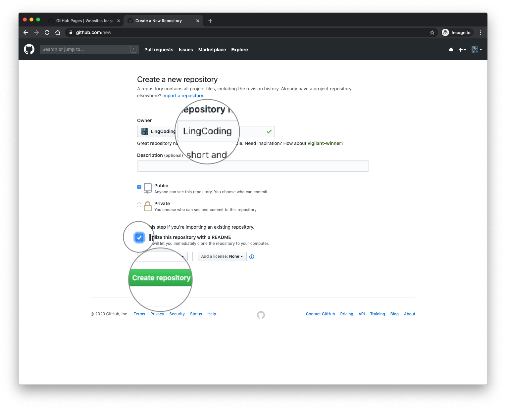
    ```
1. edit the README by clicking the pencil icon
    ```{r, echo=FALSE}
    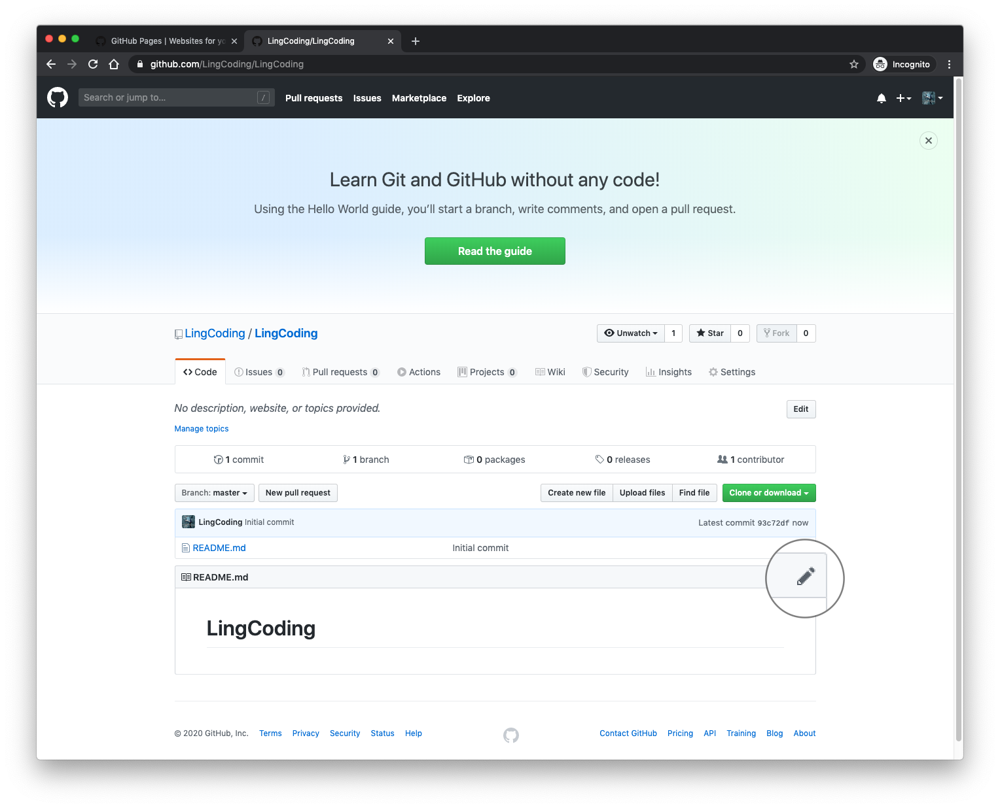
    ```
1. enter the information you want on your page
    * all (?) Markdown code elements are valid
    * you can preview the file as you work
    ```{r, echo=FALSE}
    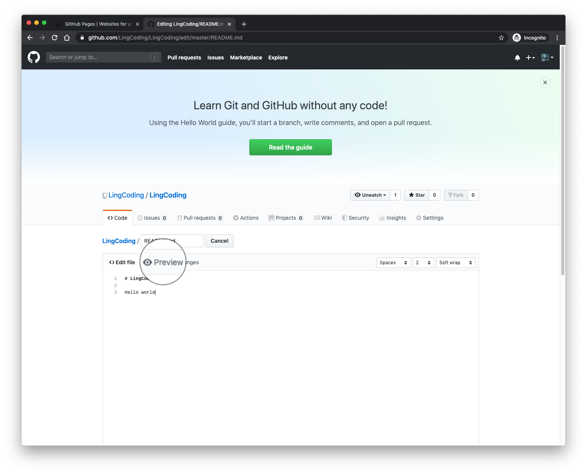
    ```
1. commit changes when you are done - this updates the file
    ```{r, echo=FALSE}
    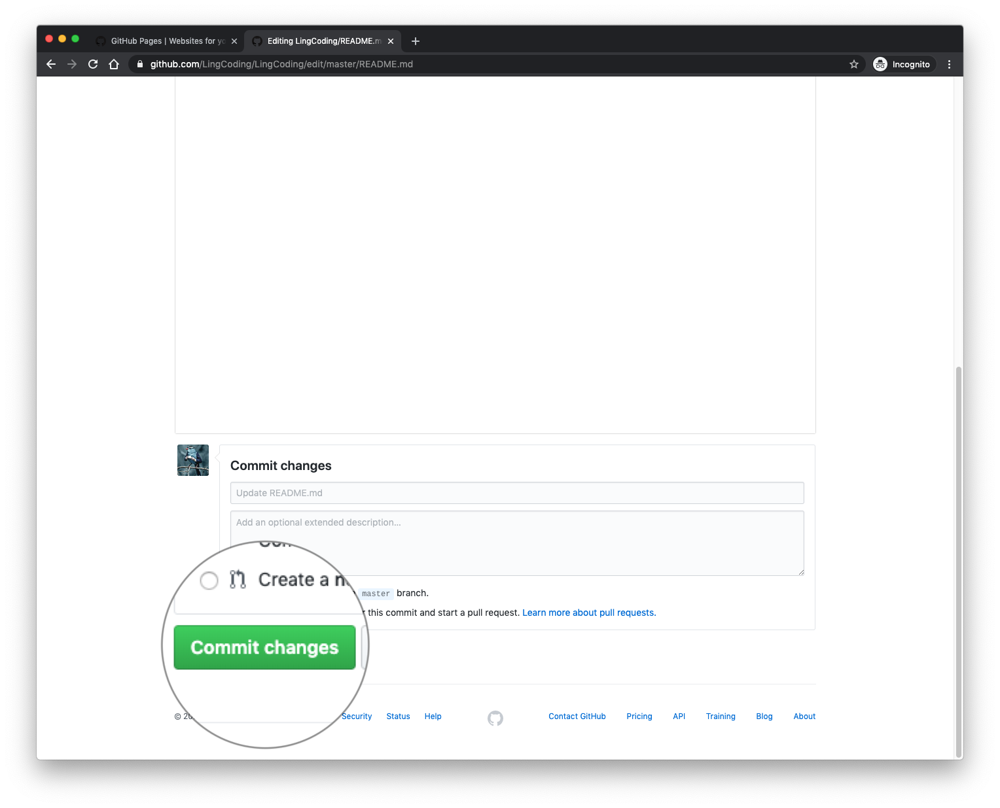
    ```
1. go to the repository's settings
    ```{r, echo=FALSE}
    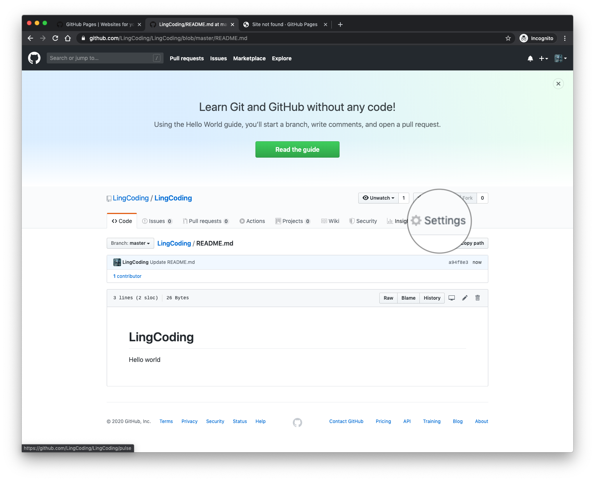
    ```
1. scroll down to the GitHub Pages section
    * change the Source to the **master branch**
    ```{r, echo=FALSE}
    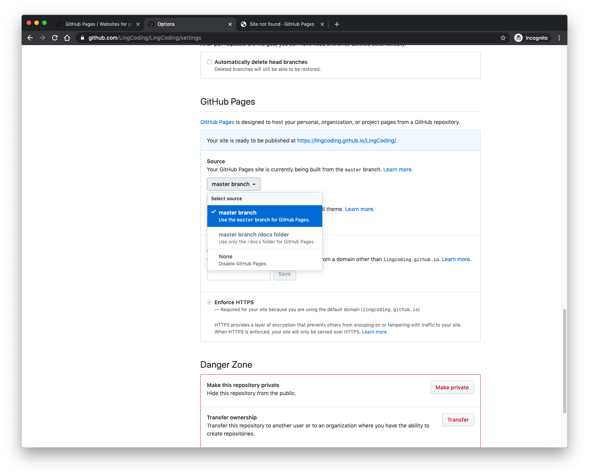
    ```
    * click the button to Choose a Theme for your page (this can be changed at any time)
    ```{r, echo=FALSE}
    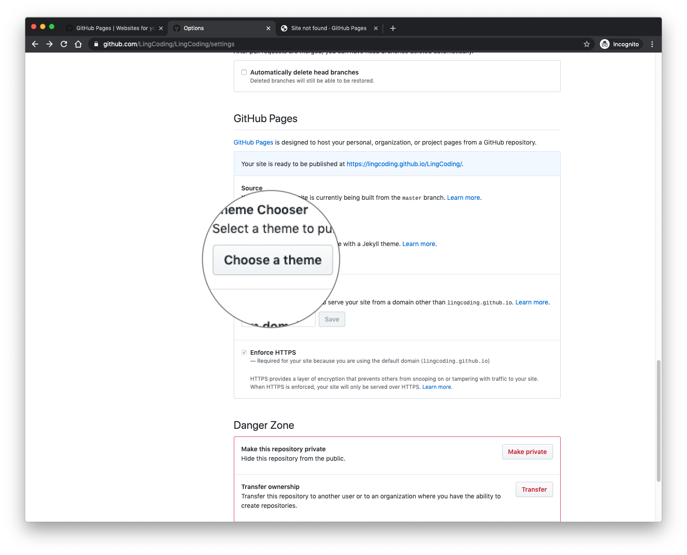
    ```
    * select your theme from the choices available
    ```{r, echo=FALSE}
    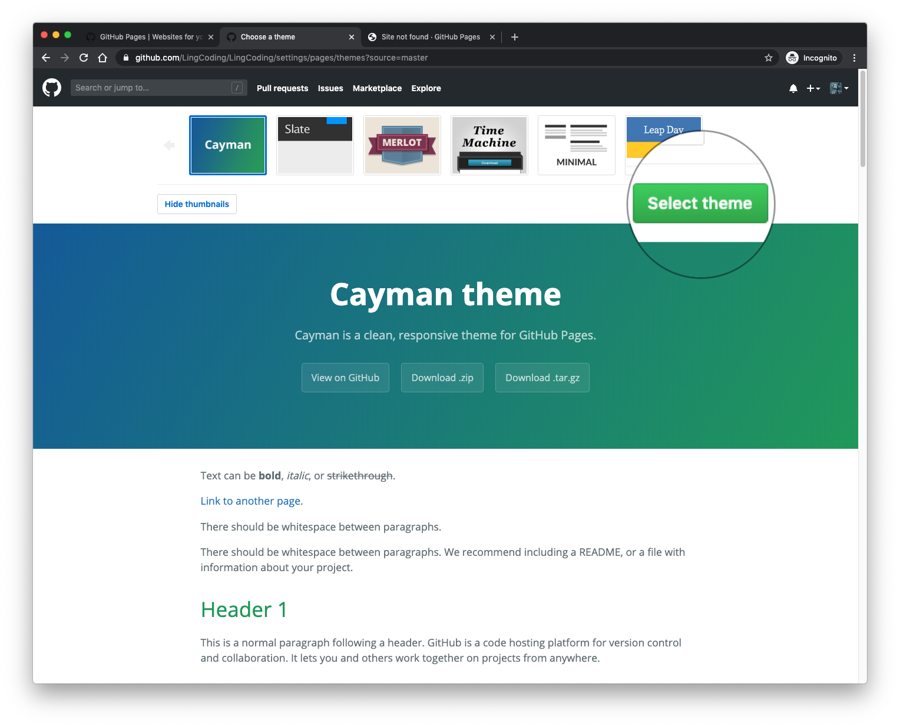
    ```
1. scroll down to the GitHub Pages section again to find the link to your GitHub Page
    * the link will always be: http://USERNAME.github.io/USERNAME/
    ```{r, echo=FALSE}
    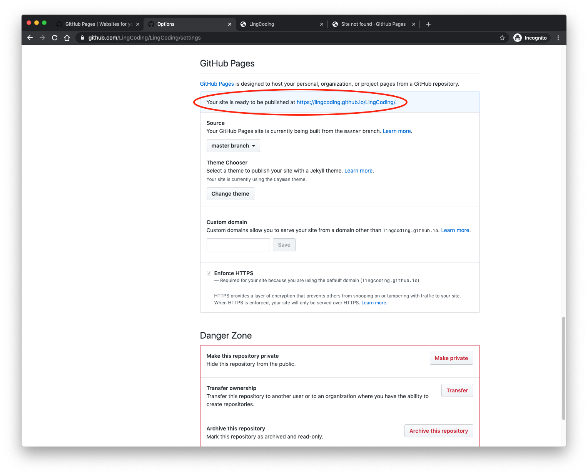
    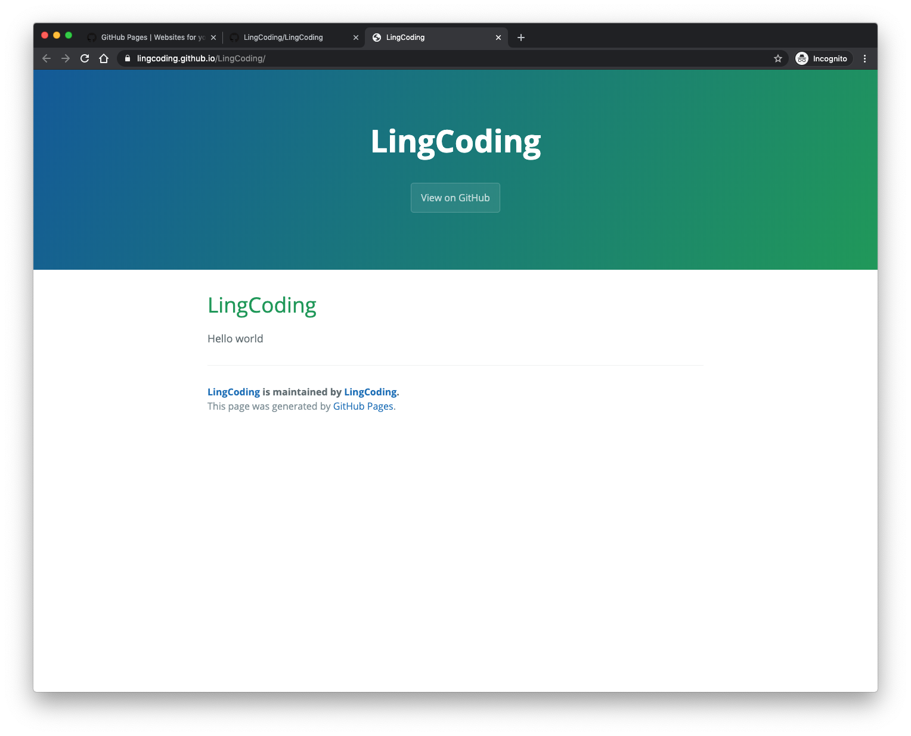
    ```

That's it! You can use R Markdown code in your page to format it how you like, *and* edit it directly in your browser at any time via the README.md file.

* R Markdown Cheat Sheet reference guide https://rstudio.com/resources/cheatsheets/
* R Markdown: The Definitive Guide https://bookdown.org/yihui/rmarkdown/

# Multi-page versions

*Complex, flexible, management involves more coding* 

## Standard html-like format

You can create a site by building invidividual pages as Markdown files within RStudio, knitting them to html files, and storing the whole thing as a repository on GitHub

* use RStudio to create individual Markdown files
* your "home" page should always be called "index.html"
* you can have as many sub-pages as you want, linked from the home page
* you can synchronize your site directly with RStudio's version control feature which can be linked to GitHub (somewhat complex to set up but easy to maintain), or you can manually upload the site and update files as you go (easy to start, maintenance is potentially errorprone)
* you register your own domain name and have it linked to GitHub Pages, so that people access your site using your domain, but everything is hosted on GitHub
* my site was created this way---originally on another server, which I moved over to GitHub last year

## Blogdown

The **blogdown** R package is "An open-source (GPL-3) R package to generate static websites based on R Markdown and Hugo": https://github.com/rstudio/blogdown

* I'm not previously familiar with its use but it looks fairly simple to get started
* install and load the `blogdown` package

```{r blogdown, eval=FALSE}
require("blogdown")
library(blogdown)
```

* use the `new_site( )` function to create a new directory---after some time, a default site will be created in that folder
* make sure the target folder is empty or you will get errors

```{r new_site, eval=FALSE}
new_site("blogdown/test_site")
```

* edit your site
* you can view it with the `serve_site()` function

```{r serve_site, eval=FALSE}
serve_site("blogdown/test_site")
```

# What to put on your site?

## Some things you might include on your site

* An "about me" page or section describing your background, research interests, etc.
* A list of your current research projects
* A list of your publications and/or presentations (a version of your CV)
* Personal info and interests
* ... ?

## Examples of sites to emulate

* Joey Stanley's site: http://joeystanley.com/
* Marissa Barlaz's site (apparently created in blogdown): https://marissabarlaz.github.io/ 
* Joe Fruehwald's site: https://jofrhwld.github.io/
* At the risk of being self-serving, my own site: http://onosson.com
* ... ?

# Using version control with GitHub and RStudio

Version control is a separate issue from website-building, but it can be used within RStudio linked with a GitHub account to manage your site on your computer. This allows for more complex sites with folders containing documents, e.g. pdf copies of your papers.

## Getting Git

Git for can be downloaded at: https://git-scm.com/downloads

```{r, echo=FALSE}
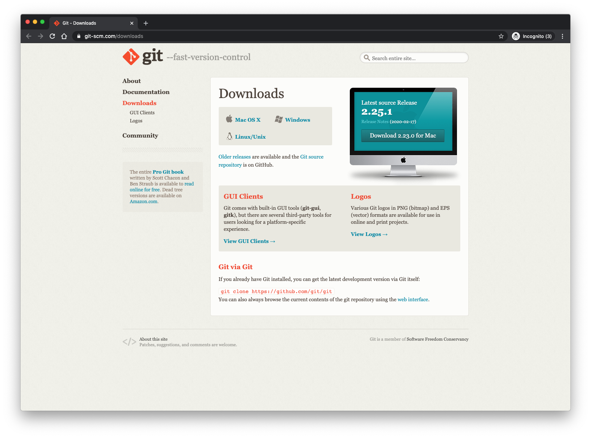
```

## Setting up RStudio for Git

After installing Git, you need to open RStudio's Global Options (on Mac: `Cmd+,`) go to the `Git/SVN` tab and check off `Enable version control interface for RStudio projects`

## Linking to a preexisting GitHub repository in RStudio

Since we created a new site on GitHub at the beginning of this workshop, you can use that repository as your first version control project.

In RStudio go to `File > New Project` and create a Version Control project...

```{r, echo=FALSE}
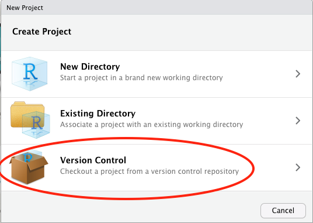
```

... select Git as the source ...

```{r, echo=FALSE}
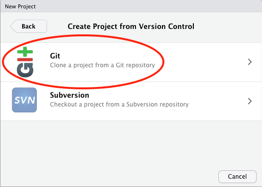
```

... and provide the URL to your repository, the name of the project, and where you want it stored on your computer.

```{r, echo=FALSE}
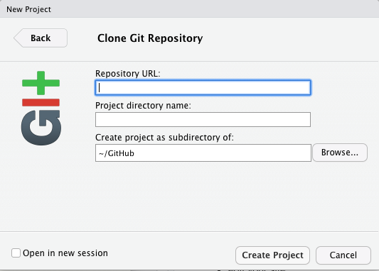
```

## Working with GitHub in RStudio

You can make whatever changes you want within the local copy of the repository on your computer inside RStudio, by editing the .rmd files etc. You can even make changes in the folder itself, by creating sub-folders, adding files such as images or pdfs, etc. All of these changes in your "local version" of the repository will be tracked by Git and compared with the "master version" stored on GitHub. If you click on the `Git` tab on the right in RStudio, you will see any changes you have made which are different and newer than GitHub's version.

```{r, echo=FALSE}
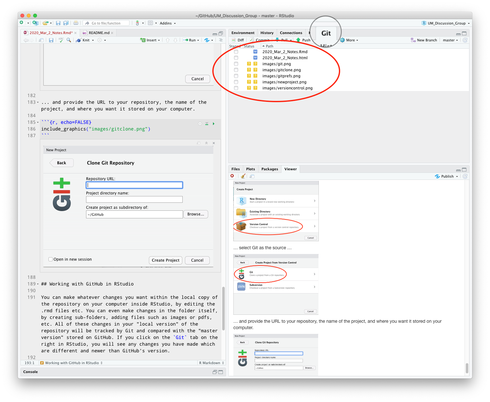
```

If you are satisfied with your changes, you need to update GitHub's copy. This has two main parts with multiple steps:

1. "Pull" to make sure you have the most recent version. I recommend always doing this, even if you're sure you have the most recent version. Just click the "Pull" button in the Git tab.

```{r, echo=FALSE}
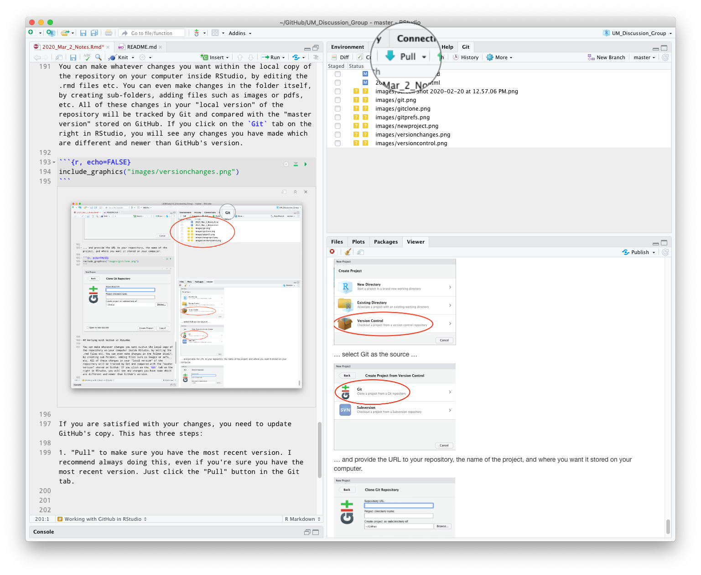
```

You should get a response that your version is "Already up to date."

```{r, echo=FALSE}
include_graphics("images/pull2.png")
```

2. "Commit" your changes. Click the "Commit" button in the Git tab, 

```{r, echo=FALSE}
include_graphics("images/commit2.png")
```

This will bring up a list of any files you have added or modified after originally downloading the repisotory.

```{r, echo=FALSE}
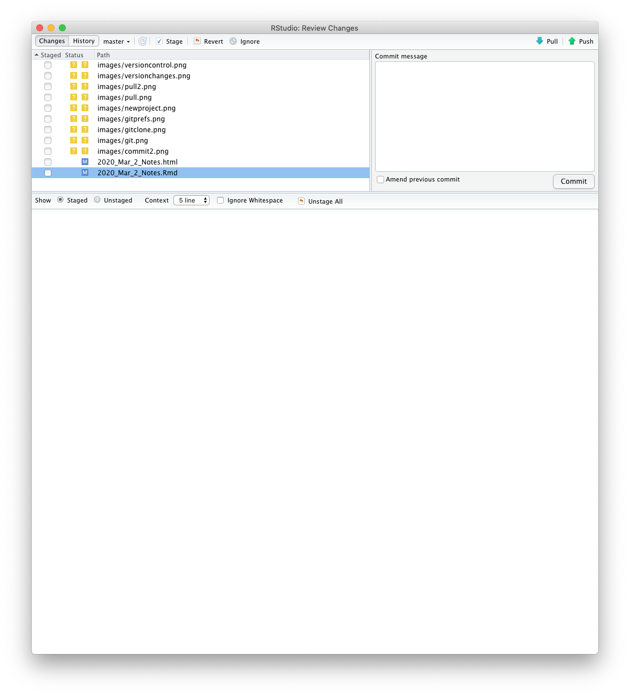
```

Check off the box next to every file you want to update. This is your opportunity to make sure that all the change you made are ones you want to keep, or discard. For some files, you may get a warning that the `diff` is "extremely large". This is usually not a problem, but just indicates that the update may take longer than usual while the file uploads.

```{r, echo=FALSE}
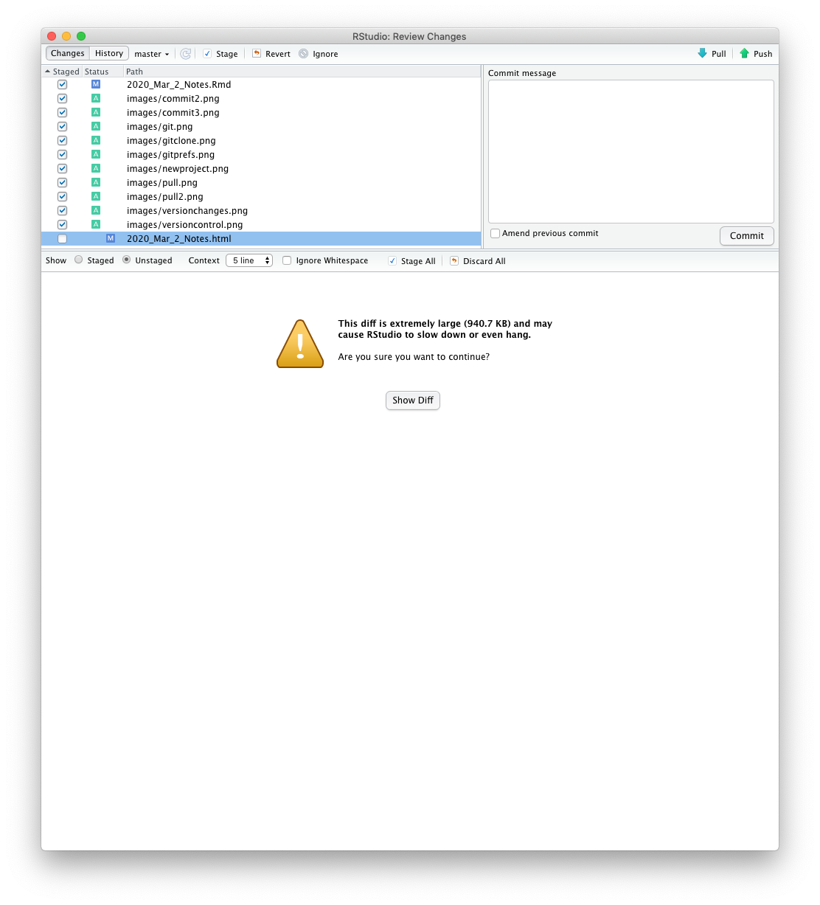
```

Enter a "commit message" - this will appear next to the edited files on GitHub as an indication of what changes were made when they were modified. Then click the `Push` button to send your changes to GitHub.

```{r, echo=FALSE}
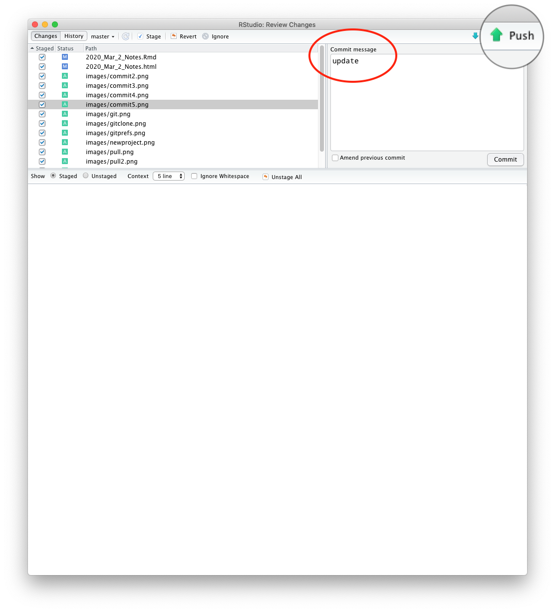
```

You should get an "Everything up-to-date" message if all went well. I always do one more `Pull` at this point just to make sure that both my local and the master versions are in sync.

```{r, echo=FALSE}
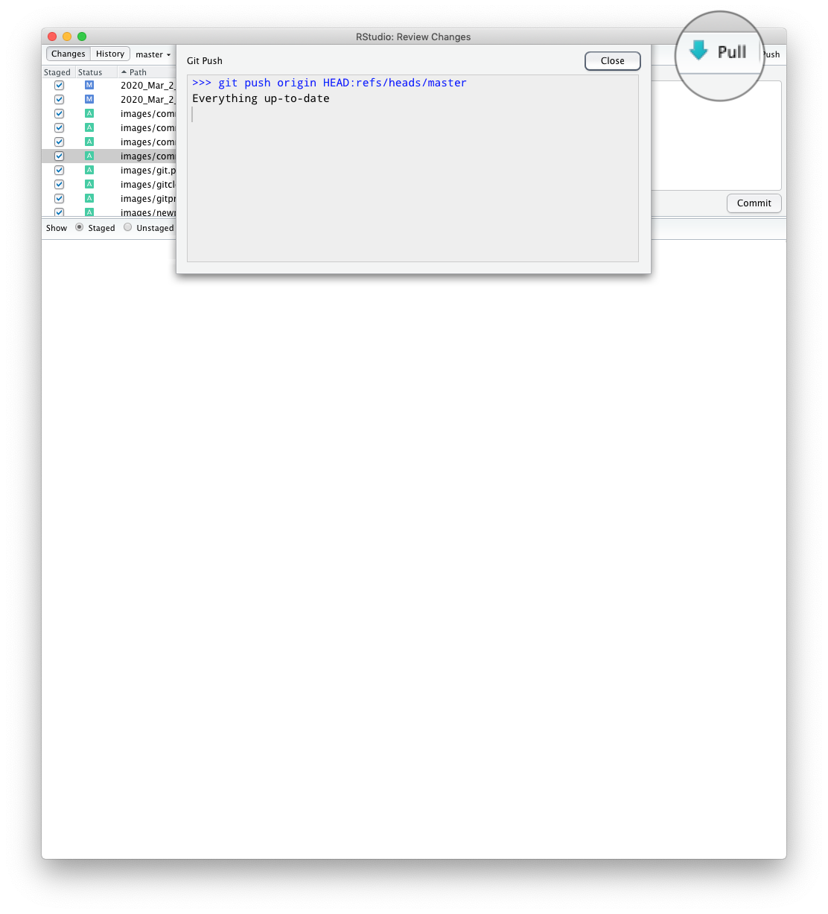
```

That's it!


