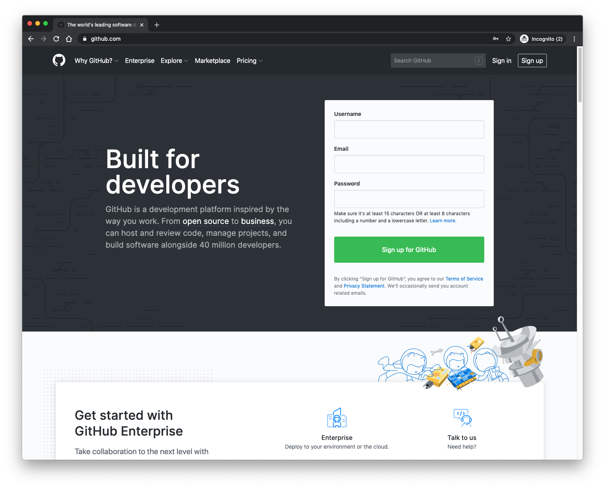

```{r setup, include = FALSE}
library(knitr)
library(tidyverse)
knitr::opts_chunk$set(echo = TRUE)
```

# How to make a personal academic website{-}

# The single-page version

*Simple, easy to manage...*

This method involves creating and maintaining your page online at GitHub, with editing done via your browser.

## GitHub Pages

* This is where your page will be hosted
* https://pages.github.com/

## GitHub

* This is where the source for your page will be hosted
* https://github.com/
* Once you have an account, you can manage other code repositories on GitHub

## Steps to make a GitHub Page

1. create an account (free version) at https://github.com/
    ```{r, echo=FALSE}
    
    ```
1. verify your account (check your email)
1. create a new repository 
    * make sure the name is identical with your username
    * be sure to check the box to initialize the repository with a README
    ```{r, echo=FALSE}
    
    ```
1. edit the README by clicking the pencil icon
    ```{r, echo=FALSE}
    include_graphics("images/edit1.png")
    ```
1. enter the information you want on your page
    * all (?) Markdown code elements are valid
    * you can preview the file as you work
    ```{r, echo=FALSE}
    
    ```
1. commit changes when you are done - this updates the file
    ```{r, echo=FALSE}
    include_graphics("images/commit.png")
    ```
1. go to the repository's settings
    ```{r, echo=FALSE}
    
    ```
1. scroll down to the GitHub Pages section
    * change the Source to the **master branch**
    ```{r, echo=FALSE}
    
    ```
    * click the button to Choose a Theme for your page (this can be changed at any time)
    ```{r, echo=FALSE}
    include_graphics("images/theme.png")
    ```
    * select your theme from the choices available
    ```{r, echo=FALSE}
    include_graphics("images/select.png")
    ```
1. scroll down to the GitHub Pages section again to find the link to your GitHub Page
    * the link will always be: http://USERNAME.github.io/USERNAME/
    ```{r, echo=FALSE}
    
    
    ```

That's it! You can use R Markdown code in your page to format it how you like, *and* edit it directly in your browser at any time via the README.md file.

* R Markdown Cheat Sheet reference guide https://rstudio.com/resources/cheatsheets/
* R Markdown: The Definitive Guide https://bookdown.org/yihui/rmarkdown/

# Multi-page versions

*Complex, flexible, management involves more coding* 

## Standard html-like format

You can create a site by building invidividual pages as Markdown files within RStudio, knitting them to html files, and storing the whole thing as a repository on GitHub

* use RStudio to create individual Markdown files
* your "home" page should always be called "index.html"
* you can have as many sub-pages as you want, linked from the home page
* you can synchronize your site directly with RStudio's version control feature which can be linked to GitHub (somewhat complex to set up but easy to maintain), or you can manually upload the site and update files as you go (easy to start, maintenance is potentially errorprone)
* you register your own domain name and have it linked to GitHub Pages, so that people access your site using your domain, but everything is hosted on GitHub
* my site was created this way---originally on another server, which I moved over to GitHub last year

## Blogdown

The **blogdown** R package is "An open-source (GPL-3) R package to generate static websites based on R Markdown and Hugo": https://github.com/rstudio/blogdown

* I'm not previously familiar with its use but it looks fairly simple to get started
* install and load the `blogdown` package

```{r blogdown, eval=FALSE}
require("blogdown")
library(blogdown)
```

* use the `new_site( )` function to create a new directory---after some time, a default site will be created in that folder
* make sure the target folder is empty or you will get errors

```{r new_site, eval=FALSE}
new_site("blogdown/test_site")
```

* edit your site
* you can view it with the `serve_site()` function

```{r serve_site, eval=FALSE}
serve_site("blogdown/test_site")
```

# What to put on your site?

## Some things you might include on your site

* An "about me" page or section describing your background, research interests, etc.
* A list of your current research projects
* A list of your publications and/or presentations (a version of your CV)
* Personal info and interests
* ... ?

## Examples of sites to emulate

* Joey Stanley's site: http://joeystanley.com/
* Marissa Barlaz's site (apparently created in blogdown): https://marissabarlaz.github.io/ 
* Joe Fruehwald's site: https://jofrhwld.github.io/
* At the risk of being self-serving, my own site: http://onosson.com
* ... ?